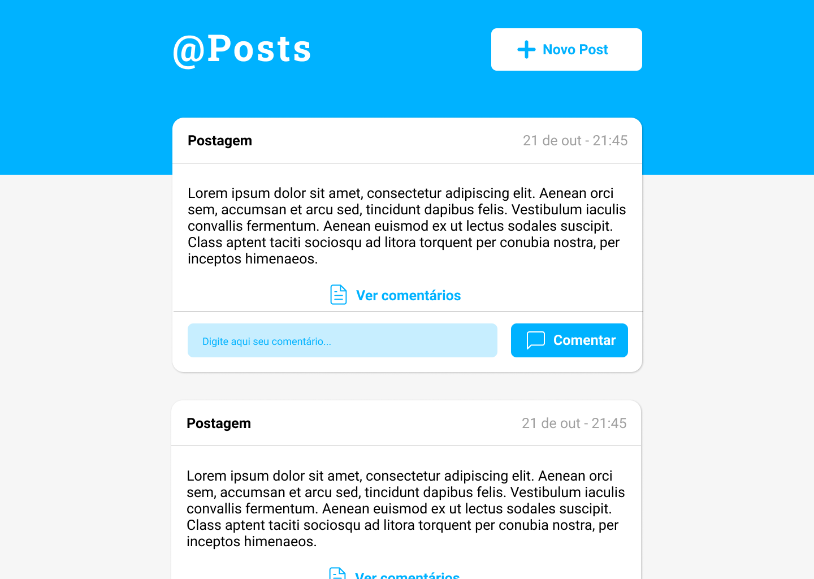

<h1 align="center"> @Posts </h1>  

  

  
  
  

## Sumário

- [Introdução](#Introdução)
- [Instalação](#Instalação)
- [Rotas da API](#Rotas)
- [Arquitetura](#Arquitetura)

## Introdução

@Posts se trata de uma pequena rede social de postagens e comentários, inspirada no twitter 

**O que pode ser feito pelo usuário no @Posts:**

* Comentar e visualizar comentários
* Fazer um novo post e visualizr os demais posts

## Instalação

**Banco de dados**

- Este projeto está utilizando de um banco de dados sqlite local, localizado em 'backend/src/database/database.sqlite', postanto não será necessário fazer nenhum tipo de conexão externa.

**Back-end**

- Clone ou faça o download do repositório.
- Abra a pasta backend `cd backend`.
- Execute os seguintes comandos:
  - `yarn` para instalar as dependencias.
  - `yarn typeorm migration:run` executa as migrations do typeorm que farão a criação de tabelas no banco de dados.
  - `yarn dev` inicia a aplicação em modo de desenvolvimento na porta 3333.

**Front-end**

- Abra a pasta frontend `cd frontend`
- Execute o comando:
  - `yarn start` inicia a aplicação React.

## Tecnologias

Para o Front-end e Back-end foi utilizado Typescript. No Back-end: Node + express em conjunto com o TypeORM, e testes unitários com jest. No Front-End: React.

## Rotas da API:
  - `/posts` POST -> cria uma nova postagem
  - `/posts`GET -> recupera todas postagens
  - `/posts/:id`GET -> recupera uma postagem específica
  - `/posts/:id/comments` POST -> Cria um novo comentário para o post equivalente ao id fornecido
  - `/posts/:id/comments` GET -> Lista os comentários de um post equivalente ao id fornecido 

  
## Paginas do Front:
  - `dashboard` Página principal com todos posts para visualização
  - `post/create` Página com listagem de itens pertencentes ao usuário logado na aplicação

## Arquitetura e organização de pastas

### Back-end: 

- Foram utilizados de conceitos SOLID em conjunto com Repositories e Services patterns, sendo implementados: single responsibility, Open-Closed Principle, injeção de depêndencias através da bilioteca
tsyringe e etc.

#### Organização de pastas:

- Dentro do src do backend encontram se as seguintes pastas

- __tests__ -> arquivos de teste
- controllers -> arquivos que abstraem o codigo de cada rota de acordo com su entidade
- database -> arquivos que se referem ao banco de dados, como o .sqlite o arquivo de conexão e as migrations
- entities -> entidades da aplicação
- repositories -> repositorios responsáveis pela comunição com o banco de dados segundo cada entidade.
- services -> Arquivos com as regras de negócio da aplicação, lembrando que são estes arquivos testados, possuindo um arquivo .spec equivalente na pasta __tests__.

- Os arquivos index.ts e routes.ts são respectivamente: o arquivo principal da aplicação e o arquivo de rotas.
- Foi utilizado de prettier e eslint para o linting e padronização de código, utilizando o template do airbnb como padrão.

### Front-end: 

- Foi utilizado de styled para toda estilização das páginas. O projeto apesar de poucas páginas teve como prioridade a componentização da maior parte do código, apenas exemplos como
o Header que se repete entre duas páginas não foi reaproveitado por não se mostrar um aproveitamento relevante.

- O cliente http escolhido para fazer as requisições foi o axios.

Espero que tenha gostado do projeto, deixe sua estrelinha ⭐ e contribua comigo! 😃

